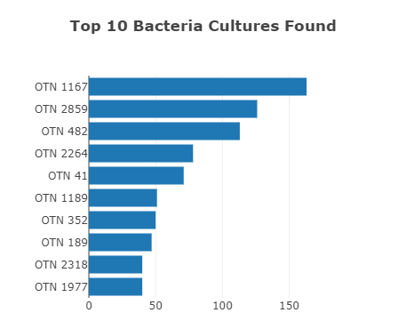
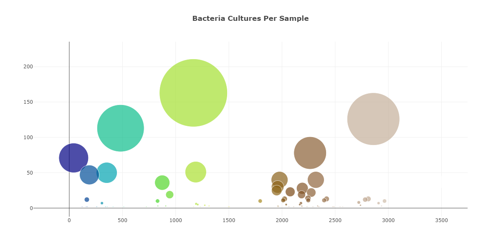
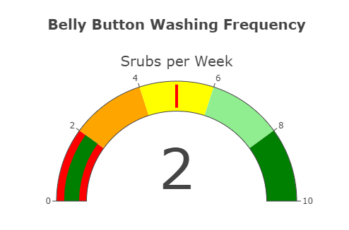

# Belly Button Biodiversity

## 1 Purpose

The the purpose of the project is to assist Improbable Beef in identifying a species of bacteria as possible a candidate to manufacture synthetic beef.  The Belly Button Biodiversity Dashboard has been prepared so that volunteers will be able to identify whether that species is found in their navel.  The  completed contains a panel for demographic information and also provides visualization of the bacterial data for each volunteer. Specifically, volunteers can now identify the top 10 bacterial species in their belly buttons. If Improbable Beef identifies a species as a candidate to manufacture synthetic beef, volunteers will be able to identify whether that species is found in their navel.

## 2 Results

https://gregorybwilson.github.io/Plotly_Deployment/

### 2.1 Customized Belly Button Biodiversity Dashboard

You will earn a perfect score for Deliverable 4 by completing all requirements below:

- The webpage has three customizations. **(10 pt)**
- Customize your dashboard with three of the following:
  - Add an image to the jumbotron. ✓
  - Add background color or a variety of compatible colors to the webpage.
  - Use a custom font with contrast for the colors.
  - Add more information about the project as a paragraph on the page. ✓
  - Add information about what each graph visualizes, either under or next to each graph.
  - Make the webpage mobile-responsive.
  - Change the layout of the page.
  - Add a navigation bar that allows you to select the bar or bubble chart on the page.
- When the dashboard is first opened in a browser, ID 940’s data should be displayed in the dashboard, and all three charts should be working according to the requirements when a sample is selected from the dropdown menu **(5 pt)**

### Demonstrating Proficiency

✓The webpage has THREE customizations. 

✓When the webpage loads, the bar and bubble chart initialize without error and update when a new sample is selected.


***Figure 1 - Customized Belly Button Biodiversity Dashboard***

### 2.2 Top 10 Bacteria Cultures Found



***Figure 2 - Horizontal Bar Chart***


You will earn a perfect score for Deliverable 1 by completing all requirements below:

- Code is written to create the arrays when a sample is selected from the dropdown menu **(10 pt)**

- Code is written to create the trace object in the

   

  ```
  buildCharts()
  ```

   

  function, and it contains the following:

   

  (10 pt)

  - The y values are the `otu_ids` in descending order
  - The x values are the `sample_values` in descending order
  - The hover text is the `otu_labels` in descending order.

- Code is written to create the layout array in the `buildCharts()` function that creates a title for the chart **(5 pt)**

- When the dashboard is first opened in a browser, ID 940’s data should be displayed in the dashboard, and the bar chart has the following:

   

  (10 pt)

  - The top 10 `sample_values` are sorted in descending order
  - The top 10 `sample_values` as values
  - The `otu_ids` as the labels

### Demonstrating Proficiency

✓Arrays are created when a new sample is selected from the dropdown menu. 

✓All THREE elements of the trace object are created, and the data is in descending order. 

✓The layout array creates a title for the chart. 

✓When the webpage loads, the bar chart behaves according to the requirements.

### 2.3 Bacteria Cultures Per Sample



***Figure 3 - Bubble Chart***


You will earn a perfect score for Deliverable 2 by completing all requirements below:

- The code for the trace object in the

   

  ```
  buildCharts();
  ```

   

  function does the following:

   

  (10 pt)

  - Sets the `otu_ids` as the x-axis values
  - Sets the `sample_values` as the y-axis values
  - Sets the `otu_labels` as the hover-text values
  - Sets the `sample_values` as the marker size
  - Sets the `otu_ids` as the marker colors

- The code for the layout in the

   

  ```
  buildCharts();
  ```

   

  function does the following:

   

  (10 pt)

  - Creates a title
  - Creates a label for the x-axis
  - The text for a bubble is shown when hovered over

- When the dashboard is first opened in a browser, ID 940’s data should be displayed in the dashboard. All three charts should also be working according to their requirements when a sample is selected from the dropdown menu **(10 pt)**

### Demonstrating Proficiency

✓All FIVE elements of the trace object are created, and data is properly displayed. 

✓All THREE elements are created with the layout. 

✓When the webpage loads, the bar and bubble chart initialize without error and update when a new sample is selected.

### 2.4 Belly Button Washing Frequency



***Figure 4 - Gauge Chart***

You will earn a perfect score for Deliverable 3 by completing all requirements below:

- The code to build the gauge chart does the following:

   

  (10 pt)

  - Creates a title for the chart.
  - Creates the ranges for the gauge in increments of two, with a different color for each increment.
  - Adds the washing frequency value on the gauge chart.
  - The indicator shows the level for the washing frequency on the gauge.
  - The gauge is added to the dashboard.
  - The gauge fits in the margin of the `<div>` element.

- When the webpage loads, the bar and bubble chart are working according to the requirements in Deliverable 1 and 2, respectively, and the gauge chart is working according to the requirements listed for this Deliverable **(10 pt)**

### Demonstrating Proficiency

✓The gauge chart on the dashboard has ALL requirements. ✓When the webpage loads, the bar, bubble, and gauge chart initialize without error and update when a new sample is selected.


### 3 Summary
